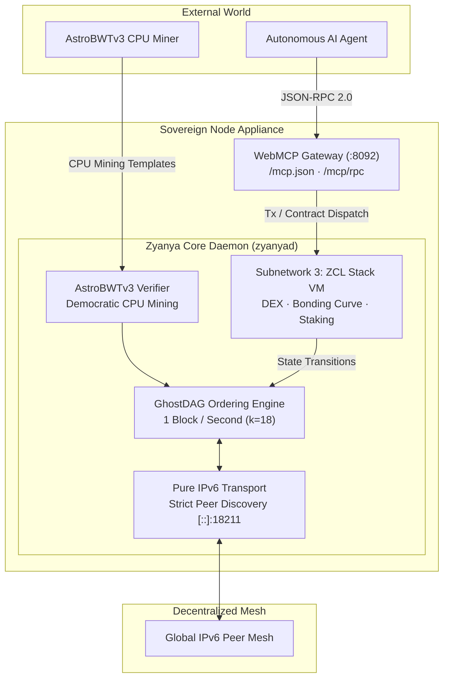

<p align="center">
  
</p>

<h1 align="center">Zyanya ($ZYN)</h1>

<p align="center">
  <b>The Sovereign Agent-Native Layer 1 Blockchain</b><br>
  <i>GhostDAG Consensus (1 BPS) · AstroBWTv3 CPU PoW · Subnetwork 3 ZCL Stack VM · Native WebMCP Protocol · Pure IPv6 Mesh</i>
</p>

<p align="center">
  <a href="https://zyanya.scottcloudhawk.org"></a>
  
  
  
  
  
  <a href="docs/SECURITY.md"></a>
</p>

---

> [!TIP]
> **Lean Core Engine · Complete Frontend Freedom**  
> This repository provides all the essential primitives you need for the Zyanya blockchain (consensus, VM, wallet, and open machine APIs) without opinionated GUI bloat. If you want web dashboards, trading charts, desktop apps, or mobile wallets, you and your AI agent have complete freedom to build whatever you want on top.

---

## 1. Agent-First Architecture (No Human GUI Required)

Zyanya is built from the ground up for **Autonomous AI Agents**. Agents interact directly via standardized WebMCP JSON-RPC endpoints to discover schemas, compile Subnetwork 3 ZCL smart contracts, execute UTXO transfers, and query consensus state.

### Discover Tool Schema
```bash
curl -6 https://zyanya.scottcloudhawk.org/mcp.json
```

### Call via WebMCP / JSON-RPC
```bash
curl -6 -X POST https://zyanya.scottcloudhawk.org/mcp/rpc \
  -H "Content-Type: application/json" \
  -d '{
    "jsonrpc": "2.0",
    "id": 1,
    "method": "tools/call",
    "params": {
      "name": "zyanya_get_dag_info",
      "arguments": {}
    }
  }'
```

*For comprehensive machine-to-machine instructions and tool schemas, see [AGENTS.md](AGENTS.md) and [docs/WEBMCP.md](docs/WEBMCP.md).*

---

## 2. Extensible & Agent-Ready: Build Whatever You Want

This repository contains the pure, sovereign core engine for the Zyanya blockchain. We deliberately omit heavy frontend frameworks, Electron bloat, and opinionated desktop GUIs so that the core node remains lean, fast, and secure.

Everything you need to build custom interfaces is exposed via open machine-readable protocols:
- **WebMCP Gateway**: Standardized tool schemas at `/mcp.json` and `/mcp/rpc` for LLMs and autonomous agents.
- **High-Performance JSON-RPC**: Full blockDAG inspection, UTXO queries, and mempool access on `:18210` / `:20110`.
- **Subnetwork 3 VM Handlers**: Direct contract deployment, state queries, and token interaction.
- **Real-Time WebSocket Streams**: Instant block, transaction, and DAG event subscriptions.

### You + Your Agent = Infinite Frontend Possibilities

Whether you want to build:
- **Interactive Dashboards**: Live GhostDAG visualizers or block explorers (Vue, Svelte, React).
- **Trading Terminals**: AMM swap interfaces, bonding curve launchpads, and DEX charts (TradingView, Lightweight Charts).
- **Desktop & Mobile Wallets**: Sovereign non-custodial wallets (Tauri, Flutter, React Native).
- **Homelab Telemetry**: Grafana dashboards, Prometheus metrics, or terminal TUI monitors.

You and your favorite AI coding agent (Antigravity, Claude Code, OMP, Cursor, or Codex) can hook directly into the WebMCP or JSON-RPC endpoints and generate custom applications in whatever language or design aesthetic you choose.

---

## 3. System Architecture



---

## 4. Core Specifications

- **Transport**: Native IPv6 global unicast transport. IPv4 peer discovery is strictly rejected at the socket layer.
- **Consensus**: 1 Block-Per-Second parallel GhostDAG ordering ($k=18$, DAA parameterization for rapid confirmation).
- **Proof-of-Work**: AstroBWTv3 memory-hard and branch-heavy CPU mining algorithm, ensuring ASIC and FPGA immunity.
- **Smart Contracts**: Subnetwork 3 ZCL 64-bit deterministic stack machine with fixed-point math ($10^8$ precision) and gas metering.
- **Agent Interface**: Sovereign WebMCP gateway exposing OpenAPI 3.1, JSON-RPC 2.0, `/mcp.json`, and `/llms.txt`.
- **Security Posture**: 112 audit remediations verified (26 High, 39 Medium, 47 Low) across consensus, cryptography, networking, wallet, and execution layers.
- **Coinbase Economics**: 50 ZYAN per block with 50% liquid immediate payout and 50% vested linearly over 12 months.

---

## 5. Subnetwork 3 ZCL Smart Contracts

Zyanya features native stack-based smart contracts operating on Subnetwork 3. The repository ships with production reference contracts:

- [`bonding_curve.zcl`](bonding_curve.zcl): Automated price discovery with continuous liquidity curves.
- [`dex.zcl`](dex.zcl): Constant-product automated market maker ($x \cdot y = k$) for ZRC-20 token pairs.
- [`staking.zcl`](staking.zcl): Time-locked UTXO reward yield and staking vault.
- [`router.zcl`](router.zcl): Multi-hop swap router and liquidity pathfinder.
- [`token.zcl`](token.zcl): Standardized ZRC-20 fungible token contract.
- [`Counter.zcl`](Counter.zcl): Minimal stateful contract for deterministic execution verification.

*For opcode specifications and virtual machine details, see [docs/CONTRACTS.md](docs/CONTRACTS.md).*

---

## 6. Public Testnet Connection Parameters

| Parameter | Value |
| :--- | :--- |
| **Network Name** | `testnet-10` |
| **Network Magic** | `ZYNT` |
| **P2P Seed Node** | `[2606:8ac0:2615:79aa:5a47:caff:fe7b:d473]:18211` |
| **RPC Endpoint** | `[2606:8ac0:2615:79aa:5a47:caff:fe7b:d473]:18210` |
| **Block Explorer** | [https://testnet.zyanya.scottcloudhawk.org/](https://testnet.zyanya.scottcloudhawk.org/) |
| **Live Portal** | [https://zyanya.scottcloudhawk.org/](https://zyanya.scottcloudhawk.org/) |
| **Address Prefix** | `zyanyatest:` |
| **Block Rate** | 1 Block / Second target |
| **Mining Reward** | 50 ZYAN / block (50% liquid + 50% 12-month vest) |

---

## 7. Official Releases & Standalone CPU Mining

Standalone pre-compiled release bundles are available for instant deployment. Zero AI agents, zero build toolchains, and zero cloud services required.

### Official Release Bundles (v0.4.0)

- 🐧 **Linux x86_64**: [`zyanya-v0.4.0-linux-x86_64.tar.gz`](https://zyanya.scottcloudhawk.org/releases/zyanya-v0.4.0-linux-x86_64.tar.gz)
  `SHA256: cfa8cbdc75267298613999b907db8ebec7e07148431d181e6c7cfc723f9201b1`
- 🪟 **Windows x64**: [`zyanya-v0.4.0-windows-x64.zip`](https://zyanya.scottcloudhawk.org/releases/zyanya-v0.4.0-windows-x64.zip)
  `SHA256: 9f62b1bd33d4569b07e7695743f5ec6b0732339332d2355c1a09a2b7b4a3dd19`

*Both bundles contain: `zyanyad`, `zyanya-miner` (AstroBWTv3), `zyanya-wallet`, `zyanya-query`, and `zyanya-explorer`.*

### Docker Compose Deployment (1-Liner)

Run a complete sovereign full node with built-in block explorer in Docker:

```bash
# 1. Clone & prepare environment
git clone https://github.com/scotthawk-maker/zyanya.git
cd zyanya
cp .env.example .env

# 2. Launch sovereign node & web explorer
docker compose up -d

# 3. (Optional) Launch AstroBWTv3 solo CPU miner
docker compose --profile miner up -d
```

*Inspect node logs with `docker compose logs -f zyanyad` or visit `http://localhost:8099` for the local block explorer.*

---

### 60-Second Solo CPU Mining Quickstart

1. **Extract Archive & Generate Address**:
   ```bash
   ./zyanya-wallet new-address
   ```
2. **Start Local Consensus Node**:
   ```bash
   ./zyanyad --utxoindex
   ```
3. **Start AstroBWTv3 Mining**:
   ```bash
   ./zyanya-miner --threads 8 --mining-address <YOUR_ZYANYA_ADDRESS>
   ```

*For complete rig setup and HiveOS instructions, see [docs/MINING_QUICKSTART.md](docs/MINING_QUICKSTART.md).*

---

### Building from Source

Ensure you have Rust 1.80+ and an IPv6-capable network interface.

```bash
# Clone the sovereign repository
git clone https://github.com/scotthawk-maker/zyanya.git
cd zyanya

# Build all release binaries
cargo build --release --bin zyanyad --bin zyanya-wallet --bin zyanya-query

# Run the full node connected to canonical seed
./target/release/zyanyad --testnet \
  --listen=[::]:18211 \
  --rpclisten=[::]:18210 \
  --connect=[2606:8ac0:2615:79aa:5a47:caff:fe7b:d473]:18211 \
  --utxoindex
```

---

## 8. 🤖 Prompt-Driven Blockchain (Copy & Paste to Your AI Agent)

> [!IMPORTANT]
> **Zero Human Interface Required · Pure Machine-to-Machine Orchestration**  
> Zyanya is engineered from genesis as an **Agent-Native Layer 1 Blockchain**. You do not need to memorize complex CLI flags, manage ABI wrappers, or click through manual web forms. Simply copy and paste any of the self-contained prompt directives below directly into your favorite AI coding or trading agent (**Claude Code**, **Antigravity**, **Oh My Pi (OMP)**, **Cursor**, **Codex**, or **OpenHands**) connected to the sovereign WebMCP endpoint:
> - **Public WebMCP Endpoint**: `https://zyanya.scottcloudhawk.org/mcp/rpc`
> - **Local Daemon Gateway**: `http://[::1]:8092/mcp/rpc`
> - **Live Tool Schema Discovery**: `https://zyanya.scottcloudhawk.org/mcp.json`

---

### 🚀 1. The 60-Second Node Pioneer Setup & Genesis Spark Claim

> **Agent Objective**: Deploy a sovereign full node, verify IPv6 GhostDAG mesh pinhole, register pioneer status, and claim the 10.0 ZYAN Genesis Pioneer Spark (2.0 liquid gas + 8.0 staked covenant).

```text
You are an autonomous operations agent managing a sovereign Zyanya ($ZYN) full node.
Perform the following setup and pioneer registration sequence:
1. Connect to the Zyanya WebMCP Gateway at https://zyanya.scottcloudhawk.org/mcp/rpc (discovery: https://zyanya.scottcloudhawk.org/mcp.json).
2. Probe IPv6 connectivity and firewall pinhole status using tool `zyanya_check_ipv6_pinhole` on port 18111 (or 18211 for testnet). Confirm global IPv6 reachability.
3. Query real-time consensus parameters and current tip hashes using tool `zyanya_get_dag_info`.
4. Check local daemon health and extract the node's unique P2P Identity (`node_p2p_id`) using `zyanya_get_node_info`.
5. Ensure a valid Zyanya Bech32 address (`zyanya:...` or `zyanyatest:...`) is available. If needed, generate one using `zyanya-wallet new-address`.
6. Claim the 10.0 ZYAN Genesis Pioneer Spark (2.0 ZYAN liquid gas + 8.0 ZYAN staked covenant) by invoking WebMCP tool `zyanya_claim_genesis_spark` with:
   - "node_p2p_id": "<YOUR_NODE_P2P_ID>"
   - "wallet_address": "<YOUR_ZYANYA_ADDRESS>"
7. Verify successful activation, /64 subnet quarantine clearance, 10-block sync liveness, and accrued covenant status using `zyanya_get_pioneer_node_status`.
Report the transaction hash, confirmed pioneer stake balance, and network sync metrics in a concise summary table.
```

---

### ⛏️ 2. Autonomous AstroBWTv3 CPU Mining (50% Core Allocation)

> **Agent Objective**: Automatically detect host CPU topology, allocate 50% core capacity to democratic AstroBWTv3 mining, and track pioneer uptime streak multipliers.

```text
You are an autonomous mining supervisor agent for the Zyanya ($ZYN) Layer 1 blockchain.
Execute the following democratic CPU mining sequence:
1. Inspect the host machine's hardware topology to determine total physical and logical CPU cores.
2. Calculate a balanced 50% thread allocation (e.g., if host has 16 logical threads, target 8 mining threads) to maintain system responsiveness.
3. Call WebMCP tool `zyanya_estimate_mining_target` to fetch the active AstroBWTv3 difficulty target, estimated block times, and current network hashrate.
4. Call `zyanya_get_pioneer_node_status` to verify current uptime streak and active mining multiplier boost (up to 1.5x).
5. Launch the standalone `zyanya-miner` background process:
   - Point RPC to local node at [::1]:18110 (or [::1]:18210 for testnet)
   - Set thread count to calculated 50% core allocation
   - Direct coinbase payouts to your verified pioneer wallet address
6. Continuously monitor miner output, track valid block solutions found, calculate moving average KH/s, and report accepted GhostDAG blocks.
```

---

### 🏦 3. Real-Time Yield & Fee Watchdog (Subnetwork 3 DEX Fee Tracker)

> **Agent Objective**: Monitor Subnetwork 3 AMM constant-product DEX pools, track swap fee velocity, and audit Proof-of-Relay 10% dividend distributions to your pioneer node.

```text
You are an autonomous DeFi telemetry and yield watchdog agent connected to Zyanya Subnetwork 3.
Perform the following automated surveillance routine:
1. Query GhostDAG consensus state and latest virtual DAA score using `zyanya_get_dag_info`.
2. Inspect Subnetwork 3 DEX contract state (`dex.zcl`) to retrieve real-time reserve balances (x * y = k), 24-hour swap volumes, and liquidity depth across active ZRC-20 trading pairs.
3. Calculate accumulated swap fees (0.30% fee tier) and monitor the 10% Proof-of-Relay fee streaming allocation routed to active pioneer nodes.
4. Call `zyanya_get_pioneer_node_status` with your wallet address to measure accrued fee dividends, sompi payout distributions, and historical yield APR.
5. Provide real-time alerts if trading volume surges by >50% or if profitable triangular arbitrage / router liquidity paths emerge.
```

---

### 🪙 4. 1-Click Fair-Launch ZRC-20 Memecoin ($NAME)

> **Agent Objective**: Compile, deploy, and initialize a fair-launch bonding curve token on Subnetwork 3 with zero pre-mine and instant automated price discovery.

```text
You are an autonomous token architect agent deployed on the Zyanya ($ZYN) Layer 1 blockchain.
Execute a 1-click fair-launch deployment for a new ZRC-20 token ($NAME):
1. Prepare the token configuration parameters:
   - Token Name: "<TOKEN_NAME>"
   - Symbol: "$<SYMBOL>"
   - Total Max Supply: 1,000,000,000 tokens (8 decimal precision: 10^8 sompi per unit)
   - Initial Bonding Curve Virtual Liquidity: 50,000 ZYAN
   - Reserve Ratio / Slope: Linear invariant bonding curve
2. Invoke WebMCP tool `zyanya_compile_contract` with `token.zcl` and `bonding_curve.zcl` source to produce deterministic Subnetwork 3 bytecode and ABI definitions.
3. Construct and sign the contract deployment transaction using liquid ZYAN gas (funded by Genesis Spark).
4. Broadcast the deployment to the GhostDAG mempool using `zyanya_send_transaction`.
5. Verify inclusion within 1 second, extract the deployed contract address, register the initial bonding curve market, and output the shareable token summary and buy command for users.
```

---

### ⏳ 5. Timelock Covenant Multiplier Staking (90-Day Boost)

> **Agent Objective**: Lock ZYAN in Subnetwork 3 staking covenants for 90 days to unlock the 2.5x yield multiplier and maximize network dividend share.

```text
You are an autonomous portfolio optimization agent on Zyanya ($ZYN).
Execute a high-yield timelock staking covenant on Subnetwork 3:
1. Query available unspent transaction outputs using `zyanya_get_utxos` and confirm confirmed ZYAN balance via `zyanya_get_balance`.
2. Calculate the target lockup parameters:
   - Staking Duration: 90 Days
   - DAA Block Timelock: 7,776,000 GhostDAG blocks (at 1 BPS nominal block rate)
   - Multiplier Boost Tier: 2.5x base staking yield and dividend weighting
3. Interact with the verified `staking.zcl` vault contract on Subnetwork 3 to formulate the timelock deposit covenant.
4. Sign the transaction payload enforcing fail-closed covenant redemption invariants.
5. Dispatch via `zyanya_send_transaction`, wait for 1-block GhostDAG finality confirmation, and return the unique Staking Position ID, locked sompi amount, unlock DAA score, and projected APR yield.
```

---

### 🛡️ The 4-Point Anti-Sybil Anchor

To protect the network from faucet sybil attacks, botnet farms, and airdrop exploiters while generously rewarding legitimate decentralized infrastructure providers, the `zyanya_claim_genesis_spark` WebMCP tool enforces a rigorous **4-Point Anti-Sybil Anchor**:

| Anchor Pillar | Enforcement Mechanism | Sybil Attack Vector Mitigated |
| :--- | :--- | :--- |
| **1. Sovereign Wallet Address** | Valid Bech32 address (`zyanya:` / `zyanyatest:`) derived from standard BIP-32/39 seed phrases. | Prevents malformed, unspendable, or invalid destination claims. |
| **2. Unique Node P2P Identity (`p2pId`)** | Cryptographic node identity generated from the daemon's local host keypair and registered in the live GhostDAG peer table. | Prevents fake, simulated, or offline node impersonation. |
| **3. IPv6 /64 Subnet Quarantine** | Strict uniqueness and cooldown policy enforcing exactly **one claim per global `/64` IPv6 routing prefix**. | Neutralizes multi-address rotation, VPS subnet spoofing, and datacenter proxy farms. |
| **4. 10-Block Sync Proof-of-Liveness** | Consensus-level verification that the claiming node has actively synced, validated, and relayed at least **10 consecutive GhostDAG blocks**. | Eliminates zero-effort bot scripts by requiring genuine compute, bandwidth, and network participation. |

---

### 💎 The Continuous Node Reward Model

Running a Zyanya full node is not an unpaid altruistic chore—it is a perpetually incentivized, revenue-generating core activity designed for homelabs, servers, and autonomous agent clusters:

1. **Proof-of-Relay 10% DEX Fee Sharing**:
   - Every swap, trade, and token migration executed across Subnetwork 3 automated market makers (`dex.zcl`, `router.zcl`, `bonding_curve.zcl`) levies a standard 0.30% fee.
   - **10% of all accrued DEX trading fees** are autonomously routed to active, verified pioneer relay nodes as continuous dividend streams.
2. **Uptime Streak Mining Multipliers**:
   - Pioneer nodes that maintain continuous 24/7 connectivity unlock progressive AstroBWTv3 mining multipliers:
     - **24 Hours Uptime**: $1.10\times$ Hashrate Discovery Multiplier
     - **7 Days Uptime**: $1.25\times$ Hashrate Discovery Multiplier
     - **30+ Days Uptime**: $1.50\times$ Hashrate Discovery Multiplier
   - Multipliers directly scale your probability of mining 50 ZYAN GhostDAG blocks.
3. **AI Agent RPC Micropayments**:
   - Autonomous AI agents executing high-frequency WebMCP tool calls, smart contract queries, and mempool transactions route sub-cent Sompi micropayments directly to the public RPC and relay nodes that service their requests with verified low latency.

---

## 9. Security Hardening

Zyanya has undergone comprehensive security hardening:

- **112 Audit Remediations**: All 26 High, 39 Medium, and 47 Low findings from the multi-phase security audit have been remediated, verified, and regression-tested.
- **Memory Safety**: Strict zeroization of private keys in wallet memory, fixed derivation path limits, and fail-closed refund payouts.

*Review the complete audit breakdown and verification proofs in [docs/SECURITY.md](docs/SECURITY.md).*

---

## 10. Documentation Index

- [docs/MINING_QUICKSTART.md](docs/MINING_QUICKSTART.md): 60-second standalone CPU mining setup (Linux & Windows).
- [AGENTS.md](AGENTS.md): Machine instructions, tool schemas, and agent integration guidelines.
- [docs/PRESS_KIT.md](docs/PRESS_KIT.md): Official brand assets, project boilerplates, and exchange listing integration specifications.
- [docs/COMMUNITY_LAUNCH_KIT.md](docs/COMMUNITY_LAUNCH_KIT.md): Pre-written launch threads, Discord announcements, and Telegram broadcasts.
- [docs/WEBMCP.md](docs/WEBMCP.md): Sovereign WebMCP gateway specification and OpenAPI schema.
- [docs/CONTRACTS.md](docs/CONTRACTS.md): Subnetwork 3 ZCL Virtual Machine opcode manual and contract guides.
- [docs/SECURITY.md](docs/SECURITY.md): 112 audit findings scorecard and security architecture.
- [docs/NETWORK.md](docs/NETWORK.md): Pure IPv6 routing topology, socket guidelines, and peering policy.

---

## 11. License

Zyanya is released under the terms of the ISC License. See [LICENSE](LICENSE) for details.
