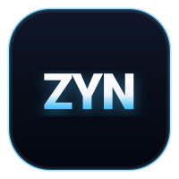
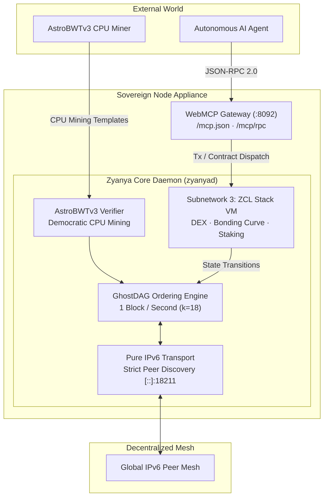

<p align="center">
  
</p>

<h1 align="center">Zyanya ($ZYN)</h1>

<p align="center">
  <b>The Sovereign Agent-Native Layer 1 Blockchain</b><br>
  <i>GhostDAG Consensus (1 BPS) · AstroBWTv3 CPU PoW · Subnetwork 3 ZCL Stack VM · Native WebMCP Protocol · Pure IPv6 Mesh</i>
</p>

<p align="center">
  <a href="https://zyanya.scottcloudhawk.org"></a>
  
  
  
  
  
  <a href="docs/SECURITY.md"></a>
</p>

---

> [!TIP]
> **Lean Core Engine · Complete Frontend Freedom**  
> This repository provides all the essential primitives you need for the Zyanya blockchain (consensus, VM, wallet, and open machine APIs) without opinionated GUI bloat. If you want web dashboards, trading charts, desktop apps, or mobile wallets, you and your AI agent have complete freedom to build whatever you want on top.

---

## 1. Agent-First Architecture (No Human GUI Required)

Zyanya is built from the ground up for **Autonomous AI Agents**. Agents interact directly via standardized WebMCP JSON-RPC endpoints to discover schemas, compile Subnetwork 3 ZCL smart contracts, execute UTXO transfers, and query consensus state.

### Discover Tool Schema
```bash
curl -6 https://zyanya.scottcloudhawk.org/mcp.json
```

### Call via WebMCP / JSON-RPC
```bash
curl -6 -X POST https://zyanya.scottcloudhawk.org/mcp/rpc \
  -H "Content-Type: application/json" \
  -d '{
    "jsonrpc": "2.0",
    "id": 1,
    "method": "tools/call",
    "params": {
      "name": "zyanya_get_dag_info",
      "arguments": {}
    }
  }'
```

*For comprehensive machine-to-machine instructions and tool schemas, see [AGENTS.md](AGENTS.md) and [docs/WEBMCP.md](docs/WEBMCP.md).*

---

## 2. Extensible & Agent-Ready: Build Whatever You Want

This repository contains the pure, sovereign core engine for the Zyanya blockchain. We deliberately omit heavy frontend frameworks, Electron bloat, and opinionated desktop GUIs so that the core node remains lean, fast, and secure.

Everything you need to build custom interfaces is exposed via open machine-readable protocols:
- **WebMCP Gateway**: Standardized tool schemas at `/mcp.json` and `/mcp/rpc` for LLMs and autonomous agents.
- **High-Performance JSON-RPC**: Full blockDAG inspection, UTXO queries, and mempool access on `:18210` / `:20110`.
- **Subnetwork 3 VM Handlers**: Direct contract deployment, state queries, and token interaction.
- **Real-Time WebSocket Streams**: Instant block, transaction, and DAG event subscriptions.

### You + Your Agent = Infinite Frontend Possibilities

Whether you want to build:
- **Interactive Dashboards**: Live GhostDAG visualizers or block explorers (Vue, Svelte, React).
- **Trading Terminals**: AMM swap interfaces, bonding curve launchpads, and DEX charts (TradingView, Lightweight Charts).
- **Desktop & Mobile Wallets**: Sovereign non-custodial wallets (Tauri, Flutter, React Native).
- **Homelab Telemetry**: Grafana dashboards, Prometheus metrics, or terminal TUI monitors.

You and your favorite AI coding agent (Antigravity, Claude Code, OMP, Cursor, or Codex) can hook directly into the WebMCP or JSON-RPC endpoints and generate custom applications in whatever language or design aesthetic you choose.

---

## 3. System Architecture



---

## 4. Core Specifications

- **Transport**: Native IPv6 global unicast transport. IPv4 peer discovery is strictly rejected at the socket layer.
- **Consensus**: 1 Block-Per-Second parallel GhostDAG ordering ($k=18$, DAA parameterization for rapid confirmation).
- **Proof-of-Work**: AstroBWTv3 memory-hard and branch-heavy CPU mining algorithm, ensuring ASIC and FPGA immunity.
- **Smart Contracts**: Subnetwork 3 ZCL 64-bit deterministic stack machine with fixed-point math ($10^8$ precision) and gas metering.
- **Agent Interface**: Sovereign WebMCP gateway exposing OpenAPI 3.1, JSON-RPC 2.0, `/mcp.json`, and `/llms.txt`.
- **Security Posture**: 112 audit remediations verified (26 High, 39 Medium, 47 Low) across consensus, cryptography, networking, wallet, and execution layers.
- **Coinbase Economics**: 50 ZYAN per block with 50% liquid immediate payout and 50% vested linearly over 12 months.

---

## 5. Subnetwork 3 ZCL Smart Contracts

Zyanya features native stack-based smart contracts operating on Subnetwork 3. The repository ships with production reference contracts:

- [`bonding_curve.zcl`](bonding_curve.zcl): Automated price discovery with continuous liquidity curves.
- [`dex.zcl`](dex.zcl): Constant-product automated market maker ($x \cdot y = k$) for ZRC-20 token pairs.
- [`staking.zcl`](staking.zcl): Time-locked UTXO reward yield and staking vault.
- [`router.zcl`](router.zcl): Multi-hop swap router and liquidity pathfinder.
- [`token.zcl`](token.zcl): Standardized ZRC-20 fungible token contract.
- [`Counter.zcl`](Counter.zcl): Minimal stateful contract for deterministic execution verification.

*For opcode specifications and virtual machine details, see [docs/CONTRACTS.md](docs/CONTRACTS.md).*

---

## 6. Public Testnet Connection Parameters

| Parameter | Value |
| :--- | :--- |
| **Network Name** | `testnet-10` |
| **Network Magic** | `ZYNT` |
| **P2P Seed Node** | `[2606:8ac0:2615:79aa:5a47:caff:fe7b:d473]:18211` |
| **RPC Endpoint** | `[2606:8ac0:2615:79aa:5a47:caff:fe7b:d473]:18210` |
| **Block Explorer** | [https://testnet.zyanya.scottcloudhawk.org/](https://testnet.zyanya.scottcloudhawk.org/) |
| **Live Portal** | [https://zyanya.scottcloudhawk.org/](https://zyanya.scottcloudhawk.org/) |
| **Address Prefix** | `zyanyatest:` |
| **Block Rate** | 1 Block / Second target |
| **Mining Reward** | 50 ZYAN / block (50% liquid + 50% 12-month vest) |

---

## 7. Building & Installation

### Quick Install (Headless 1-Liners)

#### Linux & macOS
```bash
curl -fsSL https://zyanya.scottcloudhawk.org/install.sh | bash
```

#### Windows PowerShell
```powershell
irm https://zyanya.scottcloudhawk.org/install.ps1 | iex
```

---

### Building from Source

Ensure you have Rust 1.80+ and an IPv6-capable network interface.

```bash
# Clone the sovereign repository
git clone https://github.com/scotthawk-maker/zyanya.git
cd zyanya

# Build all release binaries
cargo build --release --bin zyanyad --bin zyanya-wallet --bin zyanya-query

# Run the full node connected to canonical seed
./target/release/zyanyad --testnet \
  --listen=[::]:18211 \
  --rpclisten=[::]:18210 \
  --connect=[2606:8ac0:2615:79aa:5a47:caff:fe7b:d473]:18211 \
  --utxoindex
```

---

## 8. Security Hardening

Zyanya has undergone comprehensive security hardening:

- **112 Audit Remediations**: All 26 High, 39 Medium, and 47 Low findings from the multi-phase security audit have been remediated, verified, and regression-tested.
- **Memory Safety**: Strict zeroization of private keys in wallet memory, fixed derivation path limits, and fail-closed refund payouts.

*Review the complete audit breakdown and verification proofs in [docs/SECURITY.md](docs/SECURITY.md).*

---

## 9. Documentation Index

- [AGENTS.md](AGENTS.md): Machine instructions, tool schemas, and agent integration guidelines.
- [docs/PRESS_KIT.md](docs/PRESS_KIT.md): Official brand assets, project boilerplates, and exchange listing integration specifications.
- [docs/COMMUNITY_LAUNCH_KIT.md](docs/COMMUNITY_LAUNCH_KIT.md): Pre-written launch threads, Discord announcements, and Telegram broadcasts.
- [docs/WEBMCP.md](docs/WEBMCP.md): Sovereign WebMCP gateway specification and OpenAPI schema.
- [docs/CONTRACTS.md](docs/CONTRACTS.md): Subnetwork 3 ZCL Virtual Machine opcode manual and contract guides.
- [docs/SECURITY.md](docs/SECURITY.md): 112 audit findings scorecard and security architecture.
- [docs/NETWORK.md](docs/NETWORK.md): Pure IPv6 routing topology, socket guidelines, and peering policy.

---

## 10. License

Zyanya is released under the terms of the ISC License. See [LICENSE](LICENSE) for details.
